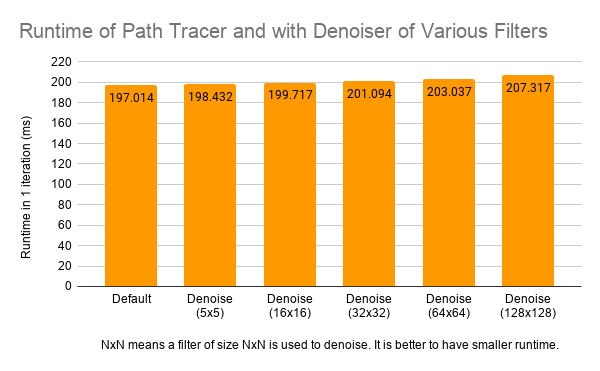

CUDA Path Tracer
================

**University of Pennsylvania, CIS 565: GPU Programming and Architecture, Project 4**

* Thy (Tea) Tran 
  * [LinkedIn](https://www.linkedin.com/in/thy-tran-97a30b148/), [personal website](https://tatran5.github.io/), [email](thytran316@outlook.com)
* Tested on: Windows 10, i7-8750H @ 2.20GHz 22GB, GTX 1070

## Denoiser
#### Note: the capture of the real-time denoiser below is different from the actual renders (check later images for actual results of real-time denoiser) ####

The denoiser in this project is based on the paper "Edge-Avoiding A-Trous Wavelet Transform for fast Global Illumination Filtering," by Dammertz, Sewtz, Hanika, and Lensch. You can find [the paper here](https://jo.dreggn.org/home/2010_atrous.pdf) The project also uses geometry buffers (G-buffers), particularly position, normal and color buffers,  to guid a smoothing filter.

|Left to right: position buffer, normal buffer.|
|---|
||

Often times, a pure path tracer will result in noisy (or grainy) renders, like the last image above, which can be improved by applying a denoiser. A denoiser can help create a smoother appearance in the path trace image by blurring pixels for each pixel. 

However, if only a kernel is applied to smooth out the image, important features such as edges of the image might be blurred as well. Hence, we need to take into account the normals, positions (distance), current colors of the current pixel and neighbor pixels to preserve crucial details. 

Another concern is a huge drag in performance if the blur filter size gets larger. Hence, instead of constructing a big filter corresponding to user's input, we can apply the filter on an image sparsely through multiple passes. The example [here](https://onedrive.live.com/view.aspx?resid=A6B78147D66DD722!95296&ithint=file%2cpptx&authkey=!AI_kS-xxETawwBw) helps explaining why it is more efficient to apply the filter sparsely under multipass. Basically, without the sparse application of the filter,for a 16x16 width/filter, there are 256 pixel reads for each pixel blurred. However, if A-Trous was applied, there are only 75 pixel reads per pixel blurred.

Here are some results of my implementation. 
|Left to right: no denoising, denoise with 32x32 filter, denoise with 64x64 filter|
|---|
||

## Performance Analysis

### Blurring edges
As mentioned, the method helps preserving edges of objects. However, there can be some blurring near edges too as below depending on the weight parameters. As one can expect, the higher the normal weight is, the sharper edges in the scene are.

|Denoiser 64x64 filter has both sharp and blurred edges|
|---|
||

|Left to right: high normal weight and low color weight, low normal weight and high color weight|
|---|
||

### Blotching
This basic denoiser does have some artifacts such as blotching (circular blurs on objects.) Ideally, it should be really smoothed out. However, the blotching effect does gets somewhat better as the filter size increases.
|Blotchy artifacts|
|---|
||

### Interaction with different materials
Denoiser works well on diffuse material because diffuse material is supposed to look uniform and smoothed out, and the denoiser attempts to do just that. However, for reflective and refractive surfaces, this is not guaranteed because the denoising process depends on the normal and position buffers. Hence, reflection on objects can be blurry (which can be enhanced by adjusting some combination of weights) because the normals of the reflections are just normals of the objects reflecting, not the normals of the objects being reflected. The same explaination can be applied for position buffer as well. As a result, the base image without the denoiser among the renders below has the sharpest reflection

|Base image (no denoiser)| Denoised image | Normal buffer | Position buffer|
|---|---|---|---|
|||||

### Runtime

As the filter size increases, there is a slight additional runtime. A larger filter size implies that for each pixel in the image, we have to consider more surrounding pixels. 

If this project is built from scratch again, I would not set up g-buffers the way they are currently. There are multiple g-buffers (normal, position, color, etc.), but it would be better if it's interleaved in one g-buffer. With one g-buffer, we have to pass fewer parameters into the gpu, which would be more efficient in terms of time and bandwidth. Moreover, for each pixel, we often get all data (position, normal, color) of that pixel, so accessing memory in one g-buffer is coherent, compared with jumping around in 3 g-buffers at once; in other words, having interleaved g-buffer makes the denoising process faster.
